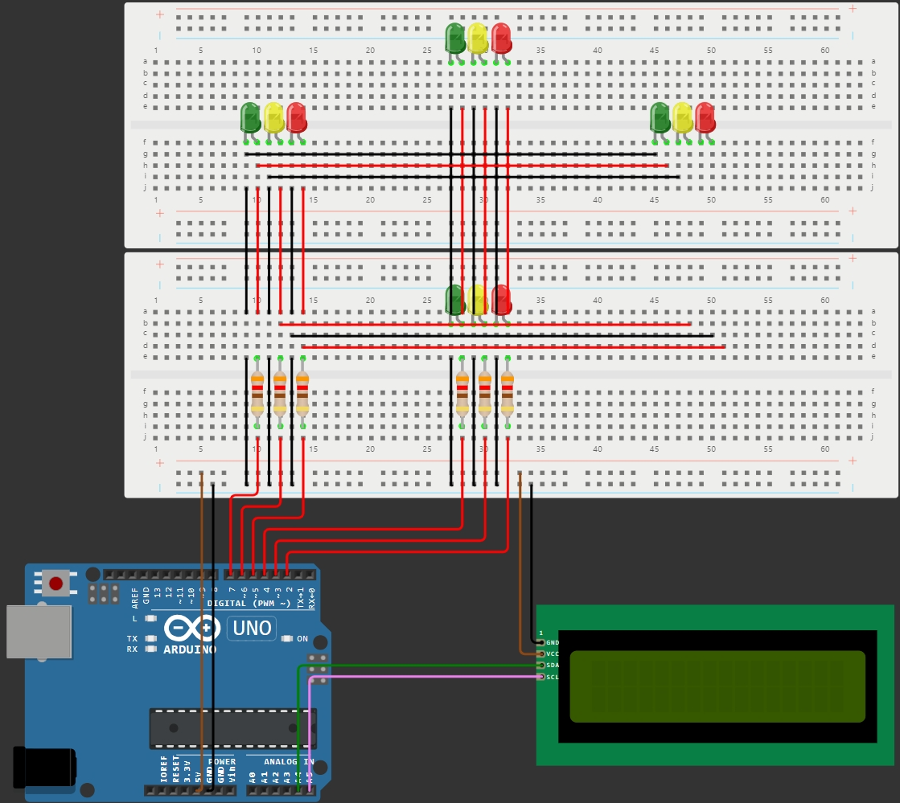

# TwoWayTrafficLight
Two-way traffic light embedded system using Arduino Uno Rev3

Several libraries are used in this project
- [LiquidCrystal_I2C](https://github.com/johnrickman/LiquidCrystal_I2C) by **Frank de Brabander**
# How to build
1. Build according to the following diagram

  

2. Open file `TwoWayTrafficLight.ino` by **Arduino IDE**
3. Press `Verify` button, before pressing `Upload` button
